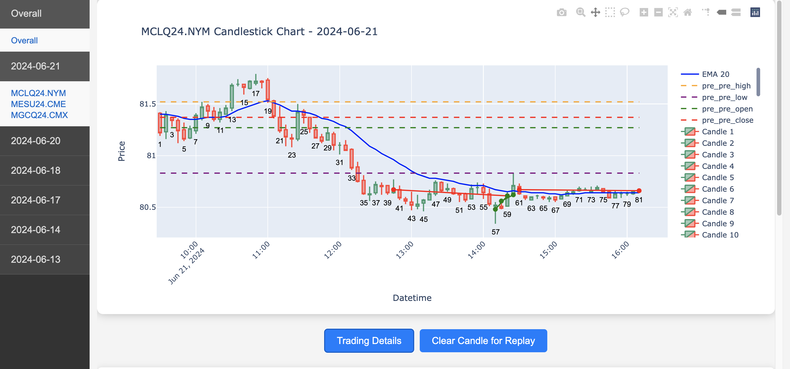

# Future Data Acquiring, Candlestick Plotting, and Performance Analysis

## Introduction
This project provides tools for retrieving stock data at specified intervals (e.g., every n minutes) from [yfinance](https://pypi.org/project/yfinance/) and conducting analyses tailored for intraday traders. The results are conveniently saved in the `./html` directory, providing easy access and organization.



## Getting Started
To utilize the tools in this project, follow the steps outlined below:

- `make` - Lists all available commands.
- `make data` - Downloads data via yfinance.
- `make report` - Generates future data in the form of candlestick plots with 5-minute intervals, and plots performance metrics. Users can also include summaries by adding them to `./note/Summary.md`, which can be included in the HTML report.
- `make clean` - Cleans all compiled files necessary for a fresh start.

Sure, here's the added section for your Markdown document detailing the `config.ini` parameters setup. This section explains the different configuration settings that users can adjust to tailor the tool's behavior to their needs.


## Configuration Settings

The `config.ini` file is essential for setting up the environment and parameters for data retrieval and analysis. Below, you'll find a detailed explanation of each section and its function:

### Global Configuration

- **log_path**: Specifies the directory where log files will be stored. Default is `./log`.
- **performance_data_path**: The path where performance data will be stored. Default is `./data/performance/`. The performace data I used in from [Tradovate](https://www.tradovate.com/)
- **future_data_path**: The directory for storing future data. Default is `./data/future/`. The Fugure data is downloaded from [yfinance](https://pypi.org/project/yfinance/)

```ini
[global]
log_path = ./log
performance_data_path = ./data/performance/
future_data_path = ./data/future/
```

### Future Data Configuration

- **start_date**: The starting date for which trading data is to be retrieved.
- **interval**: Specifies the intervals (in minutes) for the future data.
- **tickers**: Lists the ticker symbols to be used.

```ini
[future]
start_date = 2024-04-22
interval = 1, 5
tickers = MESM24.CME, MNQM24.CME
```

### Report Configuration

- **date**: The specific date for which the analysis is to be conducted.
- **ticker**: The ticker symbol that is to be analyzed.
- **summary_md_file**: The path to the Markdown file containing the summary of the analysis.
- **html_path**: The path where HTML reports will be stored.
- **html_src_path**: Directory for HTML source files.
- **template_path**: Path to Jinja2 template files used for report generation.

```ini
[report]
date = 2024-04-12
ticker = MNQM24
summary_md_file = ./notes/Summary.md
html_path = ./html/
html_src_path = ./html/src/
template_path = ./src/jinja2/
```

By adjusting these parameters in the `config.ini` file, you can customize the data acquisition and analysis processes to fit their specific requirements. This flexibility helps in optimizing the tool's functionality for various trading scenarios.


## Setup Environment
Setting up the correct environment is crucial for ensuring that the tools function properly. Use Conda to install the necessary dependencies:

```bash
conda create -f finance_env.yml
```

This will set up a Conda environment named `finance_env` based on the specifications in the `finance_env.yml` file.

## Contributing
We highly value contributions from the community. If you have suggestions for improvements or new features, feel free to submit a pull request or open an issue on GitHub. Your insights and enhancements help make this tool more effective for everyone.

## License
This project adheres to the [MIT License](LICENSE). For more details, please review the LICENSE file in the repository.

## Support
For any issues or assistance, refer to the `Issues` section on the GitHub repository page or contact the project maintainers via email.

