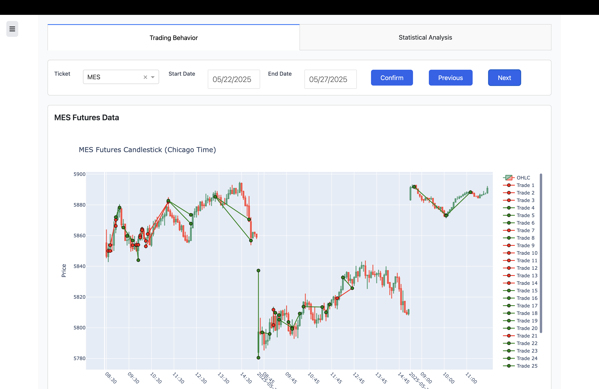
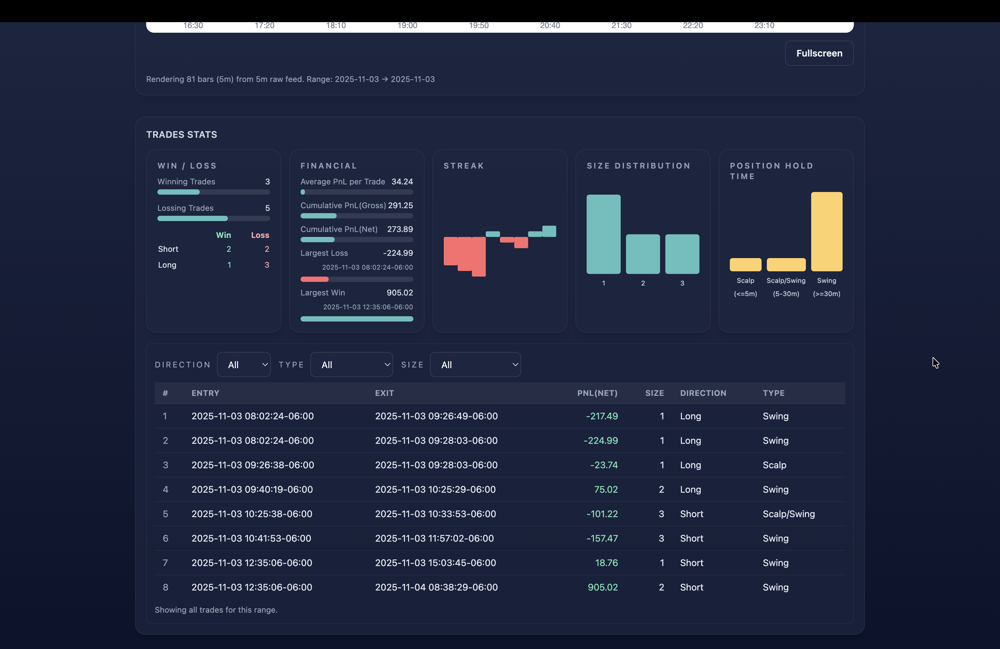
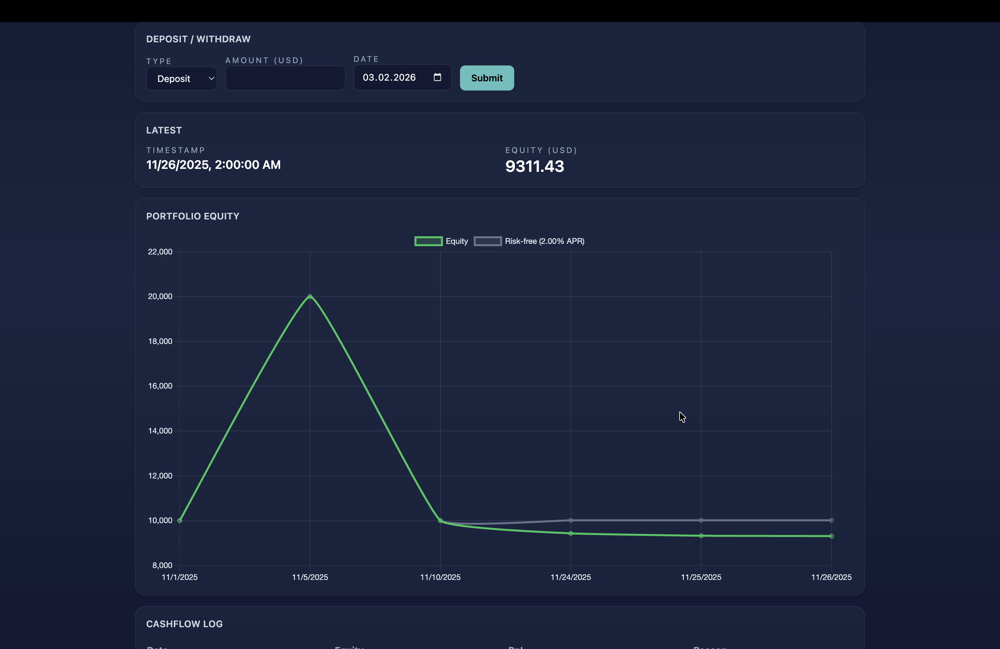
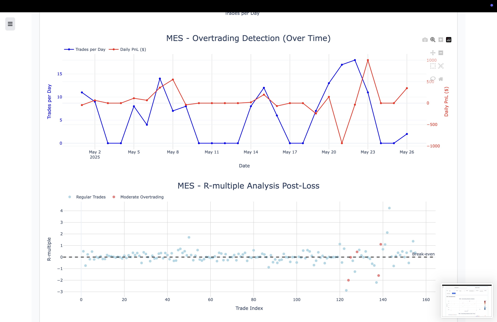

# Future Trading Dashboard

An interactive **Dash** app for futures **data acquisition**, **candlestick charts**, and **performance analysis**. Designed for easy local use and simple deployment on a  Server with Docker. Data and logs are kept on your disk so nothing is lost when containers restart.

---

## What it does

* **Market data (daily):** Automatically fetches & appends yesterday’s trading data (holiday-aware) from [yfinance](https://pypi.org/project/yfinance/)
* **Performance data (on demand):** when you drop CSVs into `data/temp_performance/`, they’re detected and processed automatically(every 5mins) into the performace data pool.
* **Dashboard:** candles, stats, and behavioral insights for instruments like **MES, MNQ, M2K, M6E, M6B, MBT, MET** (and more if you add them in the config.py).
* **Login & health:** basic login for the whole app; `/health` endpoint for simple status checks.
* **Logging:** rotating app logs in `log/app.log` + small cron logs for the background jobs.

---

## TODO

* Wrapped Backtesting Modual based on [Backtrader](https://www.backtrader.com/)
* CI/CD
* Abscract codes for better extension
* Expose the Congigurations out of py persistently
* Optimize UI

---


---

## Folders you’ll use

```
data/
  future/           # market CSVs per symbol
  performance/      # combined performance + daily performance files
  temp_performance/ # drop your raw performance CSVs here
log/                # app.log and job logs
```

*(These are mounted both locally and on the Server so files persist.)*

---

## Credentials (one file for local & Docker)

Create **`src/dashboard/config/credentials.env`** (don’t commit it):

```env
DASH_USER=yourusername
DASH_PASS=yourstrongpassword
# Generate once and paste (any long random string is fine):
# python -c "import secrets; print(secrets.token_urlsafe(32))"
SECRET_KEY=PASTE_GENERATED_SECRET_HERE
```

---

## Run locally (conda + Gunicorn)

```bash
conda activate finance_env
Serverp install -r requirements.txt
Serverp install -e .

mkdir -p data/{future,performance,temp_performance} log

# load creds into the shell for this session
set -a; . src/dashboard/config/credentials.env; set +a

gunicorn -b 127.0.0.1:8050 --workers 2 --timeout 120 wsgi:server
# open: http://127.0.0.1:8050  |  health: http://127.0.0.1:8050/health
```

**Handy make targets (optional):**

```
make run          # gunicorn locally
make performance  # process temp_performance now
make data         # fetch market data now
```

---

## Run with Docker ( Server)

1. **Prepare folders on Server (one-time):**

```bash
sudo mkdir -p /srv/trading-dashboard/{data/performance,data/future,data/temp_performance,log}
sudo chown -R $USER:$USER /srv/trading-dashboard
```

2. **Get the code & credentials:**

```bash
git clone <your repo> Future-Trading-Analysis
cd Future-Trading-Analysis
# copy your src/dashboard/config/credentials.env into this same path on the Server
```

3. **(Optional) copy your existing CSVs to the Server:**

```bash
# from your computer to the Server
# rsync -avz data/performance/ Server:/srv/trading-dashboard/data/performance/
# rsync -avz data/future/      Server:/srv/trading-dashboard/data/future/
```

4. **Start:**

```bash
docker compose build
docker compose up -d
# status check
curl -s http://127.0.0.1:8050/health   # -> ok
```

> If you use a **subdomain**, point your reverse proxy to `http://127.0.0.1:8050/`.
> If you host under HTTPS, you can also add proxy-level basic auth if you like.

---

## Background jobs (automatic)

* **Market data:** runs once per day after a small delay (configured in compose).
* **Performance data:** checks every few minutes; if it finds CSVs in `data/temp_performance/`, it processes them and removes the originals.

You can still trigger them manually:

```bash
# inside Docker
docker exec trading_jobs python /app/jobs/run_trading_if_ready.py
docker exec trading_jobs python /app/jobs/run_perf_if_files.py
```

---

## Images (examples)







## License

This project is distributed under the [MIT License](LICENSE). See the LICENSE file for full terms.

