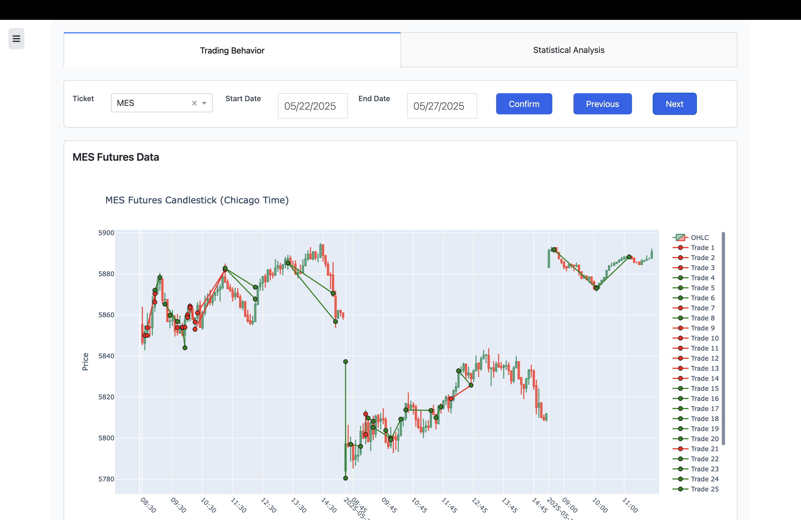
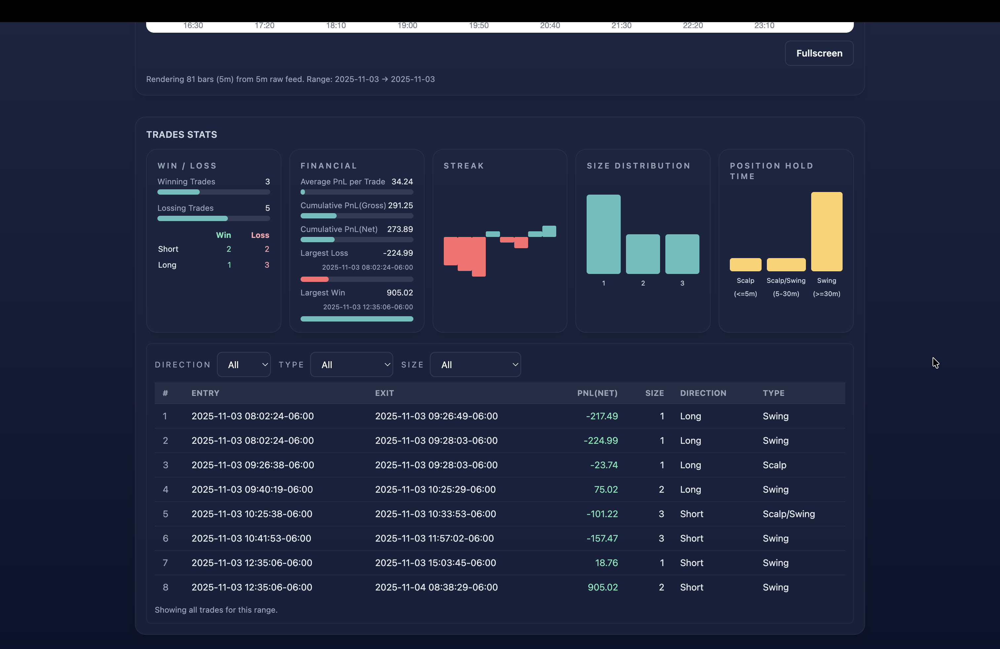
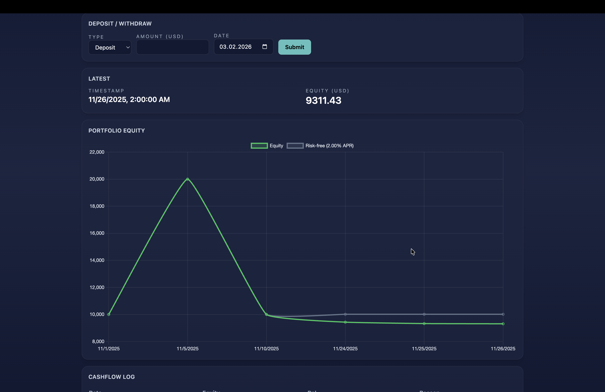
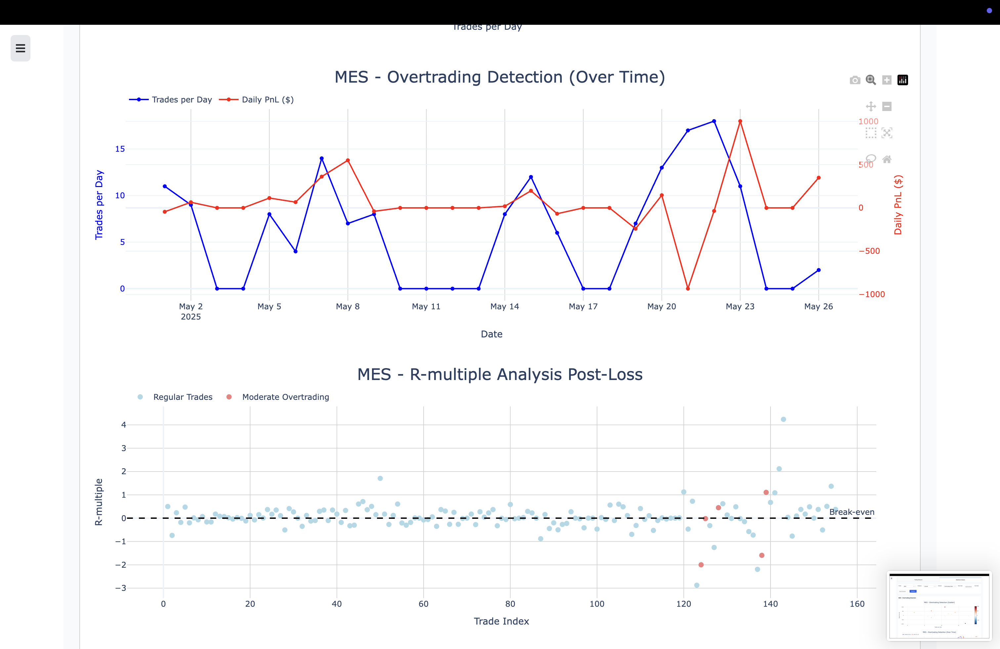

# Future Trading Analysis

Production-oriented futures trading analytics platform with a Flask API backend, Next.js frontend, scheduled data ingestion jobs, and CI/CD security gates.

## Overview

This project provides:
- Trading dashboard (candles, overlays, trade markers)
- Analysis dashboard (drawdown, PnL growth, rolling metrics, behavioral heatmap)
- Portfolio endpoints and metrics
- Background jobs for market/performance ingestion

Current stack:
- Backend: Flask + Gunicorn + pandas/numpy
- Frontend: Next.js (App Router)
- Jobs: cron-driven Python scripts
- Containers: Docker Compose (web + jobs)
- CI: quality + security + tag-based container publishing

## Architecture

Key runtime components:
- `src/dashboard/core/app.py`: Flask app bootstrap, API auth gate, CORS, `/health`
- `src/dashboard/api/routes.py`: JSON API endpoints (`/api/*`)
- `src/dashboard/services/analysis/`: analysis calculations
- `jobs/run_trading_if_ready.py`: market data sync scheduler entry
- `jobs/run_perf_if_files.py`: performance file ingestion poller
- `web/`: Next.js frontend
- `web/proxy.ts`: frontend route protection (`/trading`, `/analysis`)

Data and logs are persisted via mounted folders.

## Security Model

Important runtime behavior:
- `/api/*` requires authentication in production/runtime.
- API accepts either:
  - HTTP Basic Auth (`DASH_USER` / `DASH_PASS`), or
  - signed session cookie from frontend login.
- Session cookie is HMAC-signed + expiring (not a static value).
- CORS is restricted by `FRONTEND_ORIGIN` and does not fall back to permissive wildcard.
- `/health` remains unauthenticated for probes.

## Repository Layout

```text
src/dashboard/
  api/                 # Flask JSON endpoints
  core/                # app bootstrap/auth/cors
  config/              # settings/env/symbol catalog
  services/
    analysis/          # metric computations
    data/              # data loading
    utils/             # acquisition logic

web/                   # Next.js app
jobs/                  # scheduled job entrypoints

/data                  # runtime data (mounted)
/log                   # runtime logs (mounted)
```

## Required Environment

Create `src/dashboard/config/credentials.env` from template:

```bash
cp src/dashboard/config/credentials.env.example src/dashboard/config/credentials.env
```

Required values:

```env
DASH_USER=yourusername
DASH_PASS=yourstrongpassword
SECRET_KEY=long_random_secret
SESSION_SIGNING_KEY=another_long_random_secret
```

Do not commit real credentials.

## Local Development

### 1) Python backend

```bash
python -m venv .venv
. .venv/bin/activate
pip install -r requirements.txt
pip install -e .
set -a; . src/dashboard/config/credentials.env; set +a
gunicorn -b 127.0.0.1:5000 --workers 2 --timeout 120 wsgi:server
```

### 2) Frontend (separate terminal)

```bash
cd web
npm ci
npm run dev
```

Open:
- Frontend: `http://127.0.0.1:3000`
- Backend API: `http://127.0.0.1:5000`
- Health: `http://127.0.0.1:5000/health`

Note: `web/next.config.js` rewrites `/api/*` to `http://localhost:5000/api/*` in local frontend dev.

## Docker (Recommended Runtime)

Prepare persistent folders:

```bash
mkdir -p data/{future,performance,temp_performance,portfolio} log
```

Start:

```bash
docker compose up --build -d
```

Start(RPI):
```bash
docker compose -f docker-compose.yml -f docker-compose.rpi.yml down
docker compose -f docker-compose.yml -f docker-compose.rpi.yml pull
docker compose -f docker-compose.yml -f docker-compose.rpi.yml up -d
docker compose -f docker-compose.yml -f docker-compose.rpi.yml ps
```

Check:

```bash
curl -s http://127.0.0.1:8050/health
```

Stop:

```bash
docker compose down
```

## Scheduled Jobs

Jobs container runs cron tasks:
- Market data gate (periodic, once/day after configured delay)
- Performance ingestion poller (`data/temp_performance/*.csv`)

Manual trigger examples:

```bash
docker exec trading_jobs python /app/jobs/run_trading_if_ready.py
docker exec trading_jobs python /app/jobs/run_perf_if_files.py
```

## Performance Import Workflow (Auto + Manual Steps)

This is the recommended workflow after downloading new IBKR trade CSV files.

### Input and output files

- Raw input folder:
  - `data/temp_performance/*.csv`
- Converted per-range files:
  - `data/performance/Performance_<start>_to_<end>.csv`
- Aggregated dataset (analysis source):
  - `data/performance/Combined_performance_for_dash_project.csv`
- Journal for manual labels:
  - `data/performance/trade_journal.csv`
- Optional combo/rule definitions:
  - `data/performance/trade_journal_metadata.csv`

### What happens automatically

When `jobs/run_perf_if_files.py` runs:

1. Raw IBKR files in `data/temp_performance/` are converted to standardized `Performance_*.csv`.
2. Converted records are appended/deduplicated into `Combined_performance_for_dash_project.csv`.
3. `trade_id` is ensured and enrichment merge logic is applied.
4. `trade_journal.csv` is auto-synced by key (`TradeDay`, `ContractName`, `IntradayIndex`):
   - Missing key rows are added.
   - Existing manual fields are preserved.
   - No duplicate key rows are kept.

### What you must do manually

After new rows are synced, update `trade_journal.csv` for those rows:

- `Phase`
- `Context`
- `Setup`
- `SignalBar`
- `Comments` (free text)

If you enforce finite combinations, maintain `trade_journal_metadata.csv` with allowed/preferred rules.

### Validation and usage

- Validate journal quality:
  - `GET /api/journal/validate`
  - Optional query filters: `symbol`, `start`, `end`
- Analysis and Advanced Insights endpoints merge journal labels into analysis rows, so setup/context-driven metrics reflect journal values when present.

### Manual edits to avoid

- Do not manually edit `Combined_performance_for_dash_project.csv` in normal workflow.
- Use `trade_journal.csv` for annotation changes.

## API Quick Checks

Unauthenticated API should fail:

```bash
curl -i http://localhost:8050/api/config
```

Authenticated API should succeed:

```bash
curl -i -u '<user>:<pass>' http://localhost:8050/api/config
```

## Quality & Security Checks

Backend:

```bash
pytest -q
python -m pip check
bandit -q -r src
python -m pip_audit -r requirements.txt
```

Frontend:

```bash
cd web
npm run lint
npm run typecheck
npm run build
npm audit --omit=dev --audit-level=high
```

## CI/CD

GitHub Actions workflow includes:
- `quality` job: pytest + pip check + frontend lint/typecheck/test/build
- `security` job: bandit + pip-audit + npm audit
- `docker` job: tag-triggered multi-arch image publish (depends on quality+security)

## Release Workflow

1. Ensure branch is green in CI.
2. Create and push annotated tag:

```bash
git tag -a v1.1 -m "Release v1.1"
git push origin v1.1
```

3. Tag pipeline publishes container image.
4. Deploy by pulling tag in your target environment.

## Troubleshooting

- 401 on `/api/*` in runtime: missing auth headers or invalid session cookie.
- CI tests returning 401: ensure Flask test mode bypass is active only in tests.
- Frontend build warnings about baseline data: informational; update related package when convenient.
- If behavior differs after dependency upgrades: rebuild containers (`docker compose up --build -d`).

## Images (Examples)






## License

MIT. See [LICENSE](LICENSE).
