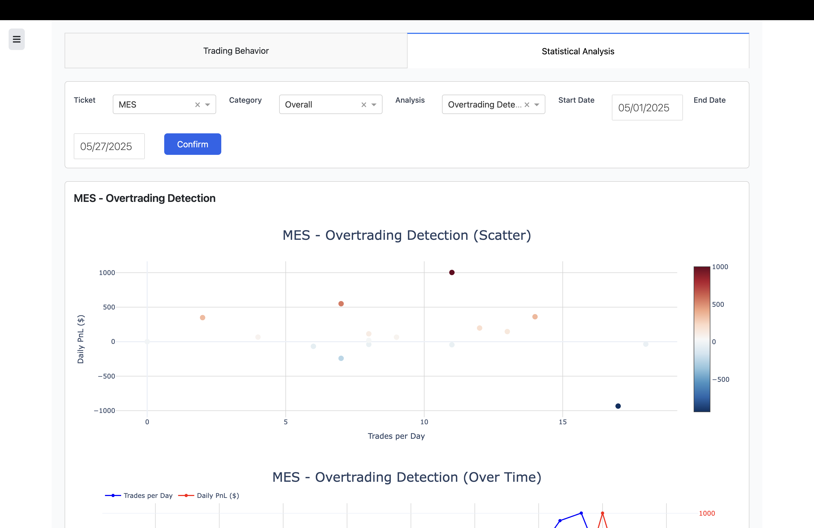

# Future Data Acquisition, Candlestick Plotting, and Intraday Performance Analysis

## Introduction

This project is transitioning from a static analysis script to a fully interactive, dynamic dashboard built with **Dash**. It supports comprehensive futures trading analysis by combining real-time market data acquisition, detailed candlestick plotting, and in-depth trade performance evaluation.

The core focus is on futures contracts MES, MNQ, and MGC, with data sourced dynamically from **Yahoo Finance (via yfinance)** for market prices and **Interactive Brokers (IBKR)** for trade performance. This enables multi-level analytics — from intraday price action to aggregated behavioral and financial metrics.

---

## Key Components & Architecture

### 1. Custom Holiday Calendar for Futures Markets

To ensure accurate date handling and avoid querying non-trading days, the system uses a **custom CME holiday calendar** based on the `pandas.tseries.holiday` framework with these key features:

* Recognizes major CME holidays such as:

  * New Year’s Day
  * Martin Luther King Jr. Day
  * Presidents' Day
  * Good Friday (two days before Easter Sunday)
  * Memorial Day
  * Independence Day
  * Labor Day
  * Thanksgiving Day (nearest Thursday)
  * Christmas Day

* Uses custom business day offsets to roll holidays forward to the next valid trading day if needed.

This calendar is integral to the data acquisition logic that calculates the last valid business day and avoids holiday-related data gaps.

### 2. Project Directory and Data File Structure

The project auto-detects its root directory (`Future-Trading-Analysis`) to maintain relative paths, improving portability across environments.

* **Performance data** (IBKR trade logs) are stored under:

  ```
  data/performance/Combined_performance_for_dash_project.csv
  ```

* **Market data for futures contracts** are maintained in:

  ```
  data/future/dash_project/MES.csv
  data/future/dash_project/MNQ.csv
  data/future/dash_project/MGC.csv
  ```

These CSV files are updated dynamically and loaded for analysis in the dashboard.

### 3. Timezone and Logging

* The entire application operates on **US/Central timezone**, aligning with CME trading hours.
* Logs are saved to `log/app.log` within the project directory to aid debugging and performance monitoring.

### 4. Trading Behavior and Data Source Configuration

* Supported futures instruments can be selected from a dropdown menu in the dashboard, mapping names to their corresponding CSV files:

  ```python
  DATA_SOURCE_DROPDOWN = {
      'MES': MES_CSV,
      'MNQ': MNQ_CSV,
      'MGC': MGC_CSV
  }
  ```

* Default data source is set to **MES**.

* The system uses the current system date to calculate the last business day and ensure fresh data pulls.

### 5. Flexible Analysis Options

The dashboard provides several types of analyses, configurable via dropdown selectors:

| Analysis Name         | Category | Key Parameters                                                         |
| --------------------- | -------- | ---------------------------------------------------------------------- |
| Drawdown              | Period   | Uses fixed frequency granularity (default weekly)                      |
| PnL Growth            | Period   | Includes daily compounding rate and initial funding (default \$10,000) |
| Performance Envelope  | Period   | Aggregated performance bands over selected intervals                   |
| Rolling Win Rate      | Rolling  | Uses rolling window (default 7 periods)                                |
| Sharpe Ratio          | Rolling  | Rolling window and risk-free rate (default 2%)                         |
| Trade Efficiency      | Rolling  | Evaluates trading performance over rolling periods                     |
| Hourly Performance    | Rolling  | Aggregates performance metrics hourly                                  |
| PnL Distribution      | Overall  | Overall distribution statistics                                        |
| Behavioral Patterns   | Overall  | Pattern recognition in trading behavior                                |
| Overtrading Detection | Overall  | Caps loss per trade and trades after big loss                          |
| Kelly Criterion       | Overall  | Computes optimal betting size based on results                         |

Users can adjust **granularity** (daily, weekly with fixed start on Monday, monthly), and **rolling window sizes** (7, 14, 30) to customize analyses.

### 6. Plot Settings and Granularity

* The system’s default timestep for candle aggregation is set to **12**, which corresponds to **1-hour candles** (12 × 5-minute intervals).
* Granularity options allow selecting daily, weekly, or monthly aggregation frequencies, essential for summary visualizations and performance trend analysis.

### 7. Data Acquisition Logic

A function computes the last valid business day dynamically, using the CME holiday calendar, to:

* Prevent querying future or holiday data from Yahoo Finance.
* Ensure that performance data from IBKR aligns with market open days.

---

## Getting Started

After cloning the repository, use these commands:

* `make`
  Lists available commands and shows usage options.

* `make live`
  Starts the Dash dashboard with live data acquisition and interactive analysis tools.

* `make performance`
  Processes your IBKR daily trade performance CSV files for integration into the dashboard's behavior analysis tab.

---

## Setup Environment

Install dependencies and set up the Python environment with:

```bash
conda create -f finance_env.yml
conda activate your_env_name  # replace accordingly
```

This environment includes essential libraries like Dash, pandas, yfinance, exchange\_calendars, and others required to run the dashboard seamlessly.

---

## Contributing

Community contributions are welcome! Please open issues for bugs or feature requests and submit pull requests for improvements. We appreciate your feedback to help refine the tool.

---

## License

This project is distributed under the [MIT License](LICENSE). See the LICENSE file for full terms.

---

## Support

For help, please use the GitHub Issues page or contact the maintainer via email.

---

### Example Visualizations





