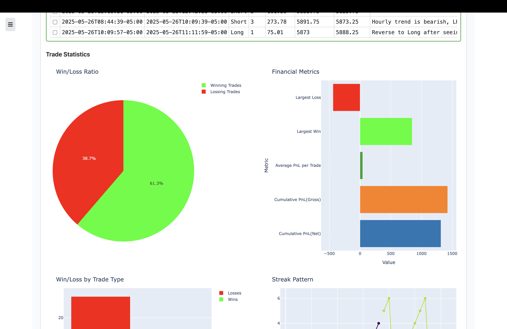

# Future Data Acquisition, Candlestick Plotting, and Intraday Performance Analysis

## Introduction
The project on the way to be changed from static to dynamic analysis using Dash

## Getting Started
Begin by executing the following commands:

- `make`: Displays all available commands.
- `make live`: dash project, more robutst analysis tools
- `make performace`: preprocess the performace data based on your daily trades(IBKR)


## Setup Environment
Ensure proper tool functionality by setting up the correct environment using Conda:

```bash
conda create -f finance_env.yml
```


## Contributing
Contributions are highly appreciated. Feel free to submit pull requests or open issues on GitHub to suggest improvements or new features. Your insights are invaluable in enhancing this tool for all users.

## License
This project is licensed under the [MIT License](LICENSE). For more information, please refer to the LICENSE file in the repository.

## Support
For assistance or inquiries, consult the `Issues` section on GitHub or contact me via email.





